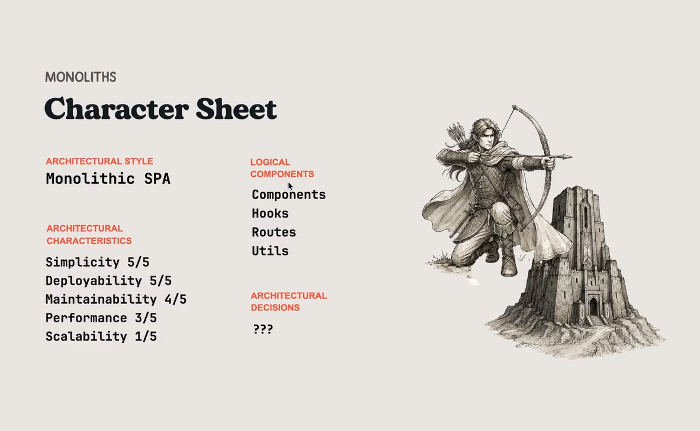
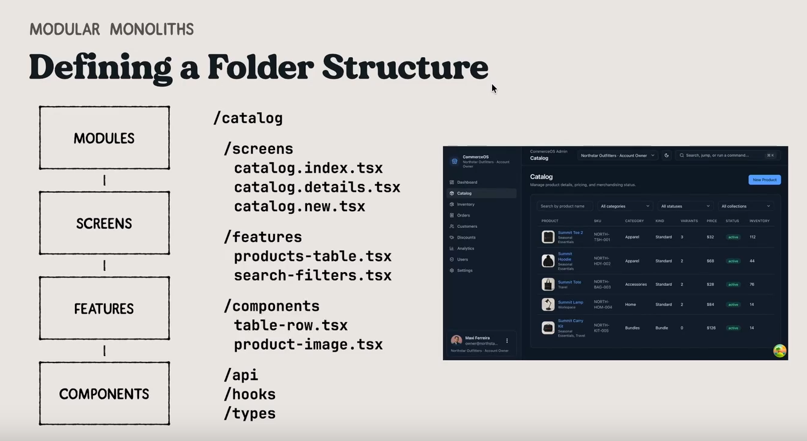
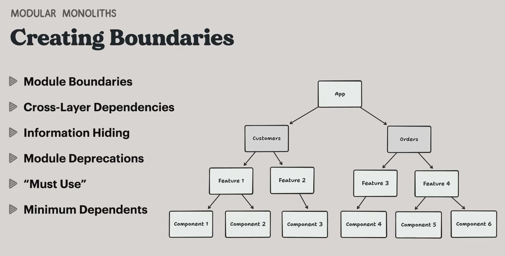
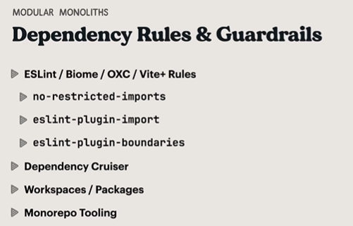

# Course Journey

## Foundations

- What is Software Architecture ?
- The 4 Pillars of Software Architecture
- Architectural Drivers
- Architecture and AI

## Monoliths

- Simple Monoliths
- Growing Pains
- Modular Monoliths
- Choosing an Architectural Style
- Setting Boundaries

## Monorepos

- Workspaces
- Migrating to a monorepo
- Scaling up with monorepo tooling
- Module boundaries

## Micro-Frontends

- How to evaluate micro-frontends
- Flavors of micro-frontends
- DIY Micro-Frontends
- Module Federation
- Micro-Frontend Communication

## What is Software Architecture anyway ?

<q>The decisions you wish you could get right early in a project</q>
Ralph Johnson

<q>A system's software architecture is the set of significant design decisions about how the software is organized to promote desired quality attributes and other properties</q>

Michael Keeling

you architecture are based on

- Business goals
- Quality attributes
- Constraints
- Functional requirements
- team's experience + knowledge
- technology trends

## The 4 Pillars of Software Architecture

- Architectural Style
- Architectural Characteristics
- Architectural Decisions
- Logical Components

# Foundations

## You can't spell architecture without AI

- You should always be re-evaluating the fundamentals. E.g readability and refactoring in software design
- Thankfully the fundamentals of software architecture have only grown more important with AI
  - Context Engineering : ADRs, ARDs, design specs
  - Harness Engineering: guidance and boundaries help autonomous agents
  - Architectural Drivers can help you find the gaps in your architecture (e.g security , reliability)

## A word on Spec-Driven Development

- Use with caution:
  - Can lead to waterfall-like hand-offs
  - Assumes you won't learn anything during implementation
  - Doesn't take advantage of LLM's ability to connect dots

## Connecting the Dots with AI

- Apply the concept of "Just Enough Architecture"
- Work on iterations
- Have a conversation

# Monoliths

## Growing Pains

- Lack of organization : harder to find things and onboard people/agents
- Unclear boundaries : no sense of ownership , teams start to step on each other
- Change amplification : seemingly small changes require touching files across the entire codebase
- Overloaded shared abstractions : the `common` folder becomes a dumping ground
- Difficult dependency management : upgrading a library becomes `all or nothing`
- Busy CI pipelines: Release trains. Builds and tests take forever.

## Choosing an architectural pattern

- Layered Architecture
- Clean Architecture
- Hexagonal Architecture
- Domain-Driven Design
- Atomic Design
- Feature-Sliced Design

### Adopting Modular Monoliths

- Use DDD subdomains to identify modules
- Keep your modules organized with a consistent folder structure
- Encapsulate modules using guardrails and dependency rules

#### Identifying Subdomains

- Strategically differentiating part of the system worth most investment E.g , Order Management
- Custom business logic that enables the core , but is not differentiating E.g Analytics
- Common , undifferentiated feature best handled with a standard solution E.g , Authentication

### Growing Pains

#### Cons

- Lack of organization harder to find things and onboard people/agents
- Unclear boundaries no sense of ownership , teams start to step on each other
- Change amplification seemingly small change require touching files across the entire codebase

#### Pros

- Overloaded shared abstractions : the `common` folder becomes a dumping ground
- Difficult dependency management : upgrading a library becomes "all or nothing"
- Busy CI pipelines : Release trains . Build and tests take forever.

# Monorepos
 
## Adopting Monorepos

- Bring repositories together into a single workspace
- Break down the monolith(s) into multiple packages
- Adopt monorepos tooling to handle dependencies and caching
